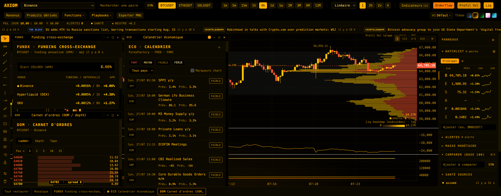

# AXIOM Terminal

Terminal de charting, orderflow et contexte macro **mono-utilisateur** (un opérateur, ses propres clés API). Crypto d’abord (spot + perp) ; tradfi / commodités en complément.

Décisions figées : voir **`BUILD-CONTRACT.md`** (renderer-first, KLineChart, indicateurs TS pur, daemon localhost hors chemin chaud, pas de multi-tenant / Electron / AggregationEngine).



## Présentation

AXIOM est un **poste de marché local**, dans l’esprit d’un terminal Bloomberg ramené à un seul
opérateur : une command line (`⌘K`), des **mnémoniques** courtes (`ECO`, `DOM`, `FUNDX`, `SCEN`…),
des fenêtres flottantes avec snap et taskbar, des workspaces commutables — le tout servi par un
process local unique et **vos** clés API.

**Pour qui.** Un opérateur qui veut lire le marché crypto (spot + perp) *et* son contexte macro
depuis un seul écran, sans abonnement ni compte. Ce n’est pas un SaaS : pas de multi-tenant, pas
d’auth réseau, rien ne quitte la machine en dehors des appels aux APIs publiques.

| | |
|---|---|
| **Lire le prix** | orderflow / CVD / footprint, profil de volume, heatmap de liquidations, **179 indicateurs** testés |
| **Lire le contexte** | **39 fenêtres** à mnémonique : calendrier éco, news, corrélations, on-chain, mouvements de baleines, treemap, options, COT, taux & liquidité Fed, saisonnalité, stablecoins, cycle halving… |
| **Décider** | screener, playbooks 1-clic, alertes (dont composite ET), backtest en R (stop ATR / sizing risque), coût d’exécution L2 (DOM), stress-test, étude d’évènements, journal, paper trading |
| **Ne pas décrocher** | alertes onglet fermé (macOS + Telegram optionnel), replay sur dumps officiels Binance, panneau de santé des sources |

Deux partis pris structurent le produit :

1. **Le chemin chaud reste direct.** Le front parle **directement** aux WebSockets des exchanges ;
   le daemon `axiomd` ne prend en charge que le lent (APIs à quota, cache, persistance SQLite,
   alertes). L’UI reste utilisable **sans** daemon.
2. **Les calculs sont du TypeScript pur et testés.** Les 179 indicateurs vivent dans
   `@axiom/indicators` — pas de WASM, pas de service Python — et sont couverts par des tests
   unitaires et structurels, dont **4 golden tests** contre un oracle `pandas-ta` (ADX,
   SuperTrend, Ichimoku, PSAR ; `scripts/golden/`).

**Hors périmètre assumé** : pas d’exécution d’ordres réels (aucune clé de trading). Le paper
trading (`PAPER`) est une simulation locale déjà présente ; pas de multi-utilisateur, pas
d’Electron.

## Architecture

```
packages/
  types/         @axiom/types       — contrat de données partagé
  indicators/    @axiom/indicators  — 179 indicateurs TS pur + golden tests
  alerts/        @axiom/alerts      — moteur d’alertes pur (front + daemon)
  backtest/      @axiom/backtest    — moteur de backtest pur
apps/
  web/           @axiom/web         — front Vite + React + KLineChart
  daemon/        @axiom/daemon      — axiomd (Bun + SQLite, 127.0.0.1:8787)
shared/
  extapi-hosts.ts                   — whitelist unique du proxy /extapi
docs/
  research/      notes fournisseurs, edge, roadmap
  superpowers/   specs & plans d’implémentation
```

**Invariant** : le front parle en **direct** aux WebSockets des exchanges. Le daemon ne proxifie / cache / persiste **que** les APIs lentes à quota et les services annexes (alertes, globe, replay…). L’UI reste utilisable **sans** daemon (feature-detect `/health` + repli localStorage).

## Prérequis

- **Node.js** 20+ et **pnpm** 9 (`packageManager` piné dans `package.json`)
- **Bun** (daemon + ses tests) : https://bun.sh
- Clés API optionnelles dans `apps/web/.env` (voir `apps/web/.env.example`)

## Installation

```bash
pnpm install
cp apps/web/.env.example apps/web/.env   # puis renseigner les clés utiles
```

## Démarrage

One-shot (recommandé) — cold-start en une commande :

```bash
pnpm run up       # daemon + Vite dev → http://localhost:5173
pnpm run up:prod  # build front + daemon → http://127.0.0.1:8787
```

> ⚠️ `run` obligatoire : `pnpm up` **nu** résout vers le builtin pnpm `update`
> (alias réservé `up`) — il ne lance pas le stack et peut muter le lockfile.

`pnpm run up` vérifie `pnpm`/`bun`, lance `pnpm install` si besoin, démarre le daemon
(log `logs/daemon.log`), attend `/health` (15 s), puis le front. Ctrl+C arrête
les process lancés par le script.

## Commandes

| Commande | Effet |
|---|---|
| `pnpm run up` | One-shot dev (daemon + Vite) |
| `pnpm run up:prod` | One-shot prod (build + daemon sert le dist) |
| `pnpm dev` | Front Vite seul (dev, proxys CORS intégrés) |
| `pnpm daemon` | Daemon localhost `127.0.0.1:8787` |
| `pnpm prod` | Build front + sert le dist via le daemon |
| `pnpm test` | Tests de tous les packages / apps |
| `pnpm typecheck` | `tsc --noEmit` sur le monorepo |
| `pnpm build` | Build récursif |
| `pnpm check` | Contrôle qualité local (typecheck + test + build web) |

Fallback dual-terminal (si besoin de séparer les logs) :

```bash
pnpm daemon       # http://127.0.0.1:8787  (optionnel en dev)
pnpm dev          # http://localhost:5173
```

Prod locale (équivalent manuel de `pnpm run up:prod`) :

```bash
pnpm prod
# ouvrir http://127.0.0.1:8787
# (Chrome mode app : open -a "Google Chrome" --args --app=http://127.0.0.1:8787)
```

## Déploiement Vercel

Le build Vercel sert le front et un proxy serverless restreint aux hôtes de
`shared/extapi-hosts.ts`. Aucun secret partagé n'est injecté dans ce proxy public : les **neuf
clés** saisissables dans **Réglages** (Coinalyze, Twelve Data, FRED, BGeometrics, SoSoValue,
Finnhub, Etherscan v2, CoinDesk Data/CCData et CoinGecko) restent dans le `localStorage` du
navigateur. OI et funding du graphe disposent d'un repli Binance sans
clé ; NVT utilise directement les charts publics Blockchain.com.

Le catalogue conserve les 179 indicateurs. Une entrée impossible pour la source, le symbole ou
le timeframe courant est désactivée et marquée **UNUSABLE** au lieu de produire un pane vide.
Les fonctions intrinsèquement locales sont également nommées : REPLAY et WHALES sont
**UNUSABLE** sur Vercel ; l'historique LIQ et les couches GDELT/UCDP de GLOBE sont **PARTIAL**.
Les snapshots, LIQHL, les alertes baleines et les notifications onglet fermé nécessitent toujours
`axiomd`.

## Fonctionnalités (aperçu)

- **Chart** : multi-grille (1 / 2h / 2v / 2×2), orderflow / CVD / footprint, volume profile, fibo, dessins, 179 indicateurs
- **Terminal** : palette ⌘K, raccourcis, workspaces, fenêtres flottantes + snap + taskbar
- **Sources** : Binance, Bybit, OKX, Coinbase, Kraken, MEXC, Deribit, Twelve Data, Coinalyze, FRED, etc.
- **Panneaux** : 39 fenêtres — DES, FUNDX, LIQ, ECO, NEWS, CORR, CHAIN, MAP, PORT, NOTE, EQS, TERM, OMON, DOM, BT, REPLAY, RATE, COT, SEAG, VOL, FUND, BRIEF, GLOBE, STBL, SQZ, CBPREM, NETLIQ, DATA, DIST, EXPY, PAPER, MINE, WHALES, CYCLE, BPL, EVTS, SCEN, CAP, SECT
- **Daemon** : proxy+cache, KV/candles SQLite, alertes (macOS + Telegram optionnel), replay dumps Binance, couches GDELT/UCDP, collecte des mouvements baleines (BTC + stables)

### Programme G100 (WTP 100 $/mois) — W0–W3 landés, gate **ouvert**

Les vagues **W0–W3** du plan `docs/superpowers/plans/2026-07-13-cible-100-usd-mois.md` sont **mergées en main** (confiance CVD/badges, `pnpm run up`, onboarding, session strip, alertes edge + funding daemon, playbooks, screener positionnement, bus panneau→chart, import CSV, brief review).

**Gate G100** : le code est *code-complete* et la partie e2e **partiellement automatisée**
(16 tests Playwright de gate, scripts G5/G9 — baseline 31/33 PASS avec 2 échecs réseau live).
Le **noyau manuel reste à dérouler** (G1 tenue 30 min + coupure 90 s, bannière macOS,
chrono onboarding, jugements visuels) — voir le protocole
`docs/superpowers/plans/2026-07-22-gate-g100-qa.md` et le plan d'action
`docs/superpowers/plans/2026-08-24-plan-action-revue-globale.md`. **Aucune nouvelle fenêtre
avant le verdict** — deux exceptions actées, toutes deux sur demande utilisateur : le 2026-08-25
(fenêtre WHALES) et le 2026-09-01 (fenêtre BPL + séries TOTAL/TOTAL2/TOTAL3 chartables, chantier
CAP/BPL) — cf. `BUILD-CONTRACT.md`.

## Secrets

En local, `apps/web/.env` (gitignoré) est lu par Vite et par le daemon ; ses clés de repli sont injectées côté proxy et restent hors du bundle navigateur.

Sur Vercel, aucune clé serveur partagée n'est utilisée. Les clés personnelles sont stockées dans le `localStorage` du navigateur et envoyées uniquement au fournisseur concerné via le proxy restreint, ou directement à Twelve Data (CORS public).

Modèle sans valeurs : `apps/web/.env.example`.

Variables optionnelles du process daemon : `AXIOMD_PORT` (défaut `8787`).

## Tests & qualité

```bash
pnpm check
# équivalent : typecheck monorepo + tests (vitest / bun:test) + build @axiom/web
```

Le gate local **`pnpm check`** reste la référence ; un filet de sécurité distant
existe en plus dans `.github/workflows/ci.yml` (typecheck + tests + build web sur
chaque push `main` et PR, étapes découpées avec timeouts individuels, Node 22).

Baseline vérifiée le 2026-08-24 : `pnpm check` PASS, **4 012 tests** verts,
build web PASS (bundle principal 1,10 Mo / 322 ko gzip), `pnpm audit --prod` sans
vulnérabilité connue, Playwright 31/33 au premier passage (2 échecs réseau live,
3/3 à la relance). Les tests unitaires couvrent indicateurs, data layer, stores,
daemon (parse, cache, globe…).

## Documentation

| Doc | Contenu |
|---|---|
| `BUILD-CONTRACT.md` | Conventions et anti-objectifs (source de vérité agents) |
| `docs/research/03-roadmap-bloomberg-perso.md` | Roadmap produit consolidée |
| `docs/superpowers/plans/2026-07-13-cible-100-usd-mois.md` | Programme multi-agent « WTP 100 $/mois » (DAG + gate G100) |
| `docs/research/02-indicateurs-edge-crypto.md` | Catalogue indicateurs à edge |
| `docs/superpowers/specs/` | Specs de design par lot |
| `scripts/golden/README.md` | Oracle pandas-ta pour golden files |

## Licence / usage

Build **personnel**. Pas de multi-tenant, pas d’auth réseau, aucune clé de trading réelle
(le paper trading est une simulation locale ; `PAPER` est inclus mais hors gate G100).
